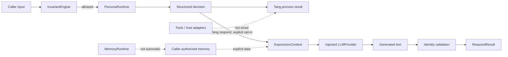

# Tang OS / 唐先生人格运行时

[](https://github.com/lc512888/tang-os/actions/workflows/test.yml) [](https://www.python.org/) [](LICENSE) [](CHANGELOG.md)

Tang OS 是一个面向“可定义、可验证、可运行的人格”的 **Python Alpha 参考实现**。它把人格决策与语言模型表达分开：本地运行时先生成结构化决策，调用方再选择是否把该决策交给外部模型表达。

Tang OS is an **alpha Python reference implementation** for definable, verifiable, runnable AI personality. It separates personality decisions from model-generated wording: the local runtime produces a structured decision first; the caller may then explicitly opt in to an external expression provider.

> 当前不是完整聊天产品、智能体编排平台或生产级设备操作系统。`tang-ta` 与 `xiaotang` 是关联概念/项目，不包含在本仓库中。
> This is not a complete chat product, agent orchestrator, or production device OS. `tang-ta` and `xiaotang` are related concepts/projects and are not included here.

## 当前能力 / What works today

| 领域 | 当前实现 / Current implementation | 边界 / Boundary |
|---|---|---|
| 人格 / Personality | `PersonaRuntime` 进行情绪、关系边界与响应策略决策 | 生产路径；规则式、进程内状态 / production path; rule-based, process-local state |
| 记忆 / Memory | 三类记忆、同意门、检索与生命周期组件 | 可独立调用，`process()` 不自动读写 / independently callable; not orchestrated by `process()` |
| 知识 / Knowledge | 规范、ADR、场景和研究文档 | 无知识检索/RAG 运行时 / no knowledge-retrieval or RAG runtime |
| 工具 / Tools | 扩展清单、沙箱、宿主传感器/执行器接口 | 参考接口与模拟器，未接入 `process()` / contracts and simulators; not wired into `process()` |
| 执行 / Execution | 不变量检查、人格决策、显式 Provider 表达 | 无自治工具循环或设备执行闭环 / no autonomous tool or device loop |

`runtime.engine`、人格模块加载器和会话注册表实现了 ADR-0057 的实验性未来运行时。它们用于验证，但尚未替代 `Tang` 当前使用的 `PersonaRuntime`。

The `runtime.engine`, personality-module loader, and session registry implement the experimental ADR-0057 future runtime. They are validation assets and do not replace the `PersonaRuntime` currently used by `Tang`.

## 数据流 / Data flow



`process()` 不访问网络、不会自动检索记忆、请求权限或调用工具。`respond()` 会先执行 `process()`，再把输入、会话历史及调用方明确传入的上下文发送给注入的 Provider。调用方负责同意、最小化与数据保留控制。

`process()` does not access the network, retrieve memory automatically, request permission, or invoke tools. `respond()` first runs `process()`, then sends input, history, and explicitly supplied context to the injected provider. The caller owns consent, minimization, and retention controls.

## 快速开始 / Quick start

需要 Python 3.11 或更高版本。 / Requires Python 3.11+.

```bash
python -m pip install -e .
python -m tang_os version
python -m tang_os describe
```

离线结构化决策 / Offline structured decision:

```python
from tang_os import Tang

tang = Tang(state_path=".tang_state.json")
result = tang.process("我今天很难过")
print(result["response_decision"])
```

显式启用自然语言表达 / Explicitly opt in to generated wording:

```python
from tang_os import Tang
from providers.llm import DeepSeekProvider

tang = Tang(provider=DeepSeekProvider(api_key="..."))
result = tang.respond("我今天很难过")
print(result.text if result.allowed else result.error_code)
```

DeepSeek 是当前实现远程调用的适配器，并需要可选的 `openai` 包；OpenAI、Claude 和 Local 适配器目前是返回 `provider_unsupported` 的接口骨架。不要提交或记录 API key。

DeepSeek is currently the adapter with a remote-call implementation and requires the optional `openai` package. OpenAI, Claude, and Local are interface skeletons returning `provider_unsupported`. Never commit or log API keys.

## 测试与打包 / Test and package

```bash
python -m pip install -e ".[test]"
python -m pytest -q
python run_conformance.py
python -m build
python tools/verify_distribution.py --artifacts dist
```

最终候选提交的完整验证结果为 **512 passed, 4 skipped**；conformance 为 **PASS**。跳过项涉及需要真实 Provider 凭据的集成。历史报告中的旧数字是当时快照，不代表当前 HEAD。

The final candidate commit completed with **512 passed, 4 skipped** and conformance **PASS**. Skips cover integrations requiring real provider credentials. Older numbers are historical snapshots, not current-HEAD claims.

只使用公开包名导入，如 `tang_os`、`runtime`、`kernel`。`src/` 是 setuptools 源码布局，不是 Python 命名空间；不要使用 `src.*` 导入。

Use public package names such as `tang_os`, `runtime`, and `kernel`. `src/` is the setuptools source layout, not a Python namespace; do not use `src.*` imports.

## 目录 / Repository map

```text
.
├── src/
│   ├── tang_os/          # public facade, CLI, transparency
│   ├── kernel/           # identity, invariants, state
│   ├── runtime/          # persona, memory, permission, experimental engine
│   ├── providers/        # expression-provider contracts/adapters
│   ├── extensions/       # extension contracts and sandboxing
│   ├── host/             # host/actuator/sensor simulation
│   └── tang_os_sdk/      # developer SDK
├── tests/                # boundary, security, conformance and unit tests
├── examples/             # E2/E3/E4 and provider examples
├── docs/                 # specifications, ADRs, research, guides, report
├── validation/           # external-validation materials
├── run_conformance.py    # conformance entry point
└── pyproject.toml        # build and package metadata
```

## 安全边界 / Security boundaries

- 身份与不变量由运行时检查；扩展能力不等于权限提升。 / Identity and invariants are runtime-checked; adding capability does not grant authority.
- `ExpressionContext` 限制结构、深度、大小和角色，并把调用方指令及记忆标为不可信数据。 / `ExpressionContext` bounds structure, depth, size, and roles, and labels caller instructions and memory as untrusted data.
- Provider 输出返回前进行身份验证；远程失败使用稳定错误码。 / Provider text is identity-validated before return; remote failures use stable error codes.
- `Tang` 包含会话状态；每个会话/工作线程使用独立实例。 / `Tang` contains session state; use one instance per session/worker.
- 状态文件不是加密秘密存储；生产宿主必须补充访问控制、加密、审计与删除。 / The state file is not encrypted secret storage; production hosts must add access control, encryption, audit, and deletion.
- 本项目不替代医学、法律或紧急服务。 / This project is not a substitute for medical, legal, or emergency services.

详见 [SECURITY.md](SECURITY.md) 和 [完整中英双语项目报告](docs/TANG_OS_FULL_REPORT_CN_EN.html)。

## 成熟度与路线图 / Maturity and roadmap

当前成熟度为 **Alpha 参考实现**：核心边界已有较丰富自动化验证，但端到端编排、持久化治理、Provider 覆盖、性能/并发验证与真实部署运维仍需完善。

Current maturity is an **alpha reference implementation**: core boundaries have substantial automated validation, while end-to-end orchestration, persistence governance, provider coverage, performance/concurrency validation, and production operations remain incomplete.

1. 固化公开 API、错误 schema、版本与发布证据。 / Stabilize public APIs, error schema, versioning, and release evidence.
2. 设计显式的记忆—同意—知识—工具编排契约，默认拒绝。 / Design an explicit memory–consent–knowledge–tool orchestration contract with deny-by-default behavior.
3. 完善 Provider 的超时、重试、可观测性与隐私策略。 / Complete provider timeout, retry, observability, and privacy policies.
4. 统一或退役双运行时路径，并保留迁移测试。 / Unify or retire the dual runtime paths while retaining migration tests.
5. 增加并发、恢复、模糊测试、依赖与供应链扫描。 / Add concurrency, recovery, fuzzing, dependency, and supply-chain testing.

## 文档与贡献 / Documentation and contributing

- [文档导航 / Documentation index](docs/README.md)
- [完整中英双语报告 / Full bilingual report](docs/TANG_OS_FULL_REPORT_CN_EN.html)
- [架构总览 / Architecture overview](docs/architecture/SYSTEM_ARCHITECTURE_OVERVIEW.md)
- [贡献指南 / Contributing](CONTRIBUTING.md)
- [变更记录 / Changelog](CHANGELOG.md)
- [许可证 / License](LICENSE)

提交前运行测试与一致性门禁，并保持三条边界：人格逻辑不进入产品层、Provider 不拥有人格、工具能力不扩大权限。

Before contributing, run tests and conformance gates, preserving three boundaries: personality logic does not move into products, providers do not own personality, and tool capability does not expand authority.
